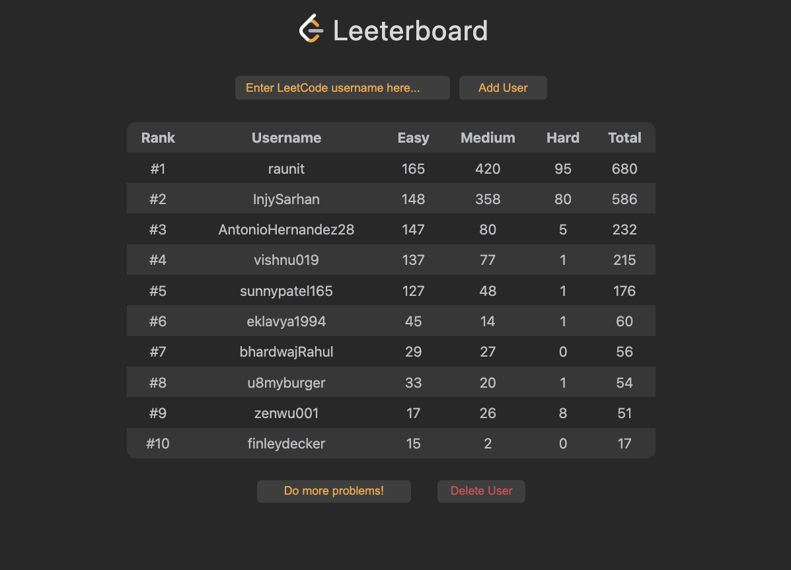

# Leeterboard

Feeling alone in the LeetCode grind? Lacking motivation with your interview
prep?

Introducing _**Leeterboard**_, a social app for LeetCode!

Now, you can add your friends to a Leeterboard to track each other's LeetCode
stats. Get motivated and battle for the top rank!

### _How to use_

To use, simply enter your LeetCode username and click the 'Add User' button.
Your LeetCode stats will then be added to the Leeterboard.

To remove a user, click on a row to select it and then click the 'Delete User'
button.

### Future features:

- streaks
- sort by column
- private urls for Leeterboards
